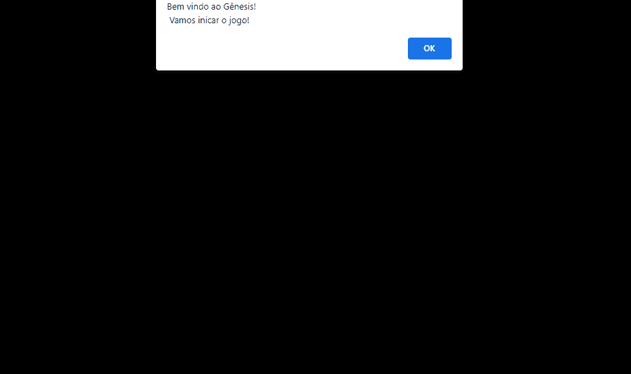

 # Projeto Jogo Genius
Um jogo de memória criado, estilo o jogo Genius!   

      

## Funcionalidades

🗸 Tema mantido na página inteira  
🗸Sistema de cores aleatórias para o usuário utilizar 
🗸Mensagem com a pontuação 
🗸Mensagem mostrando se está perdendo ou ganhando 

## Linguagens utilizadas no projeto
* Html
* CSS
* Java Script

## Autor(a)

| Rayra de Sousa  
| rayratanisiadigital@gmail.com 
| [Meu Linkedin](https://www.linkedin.com/in/rayra-tanisia-sousa-624578204/)

Projeto  em construção😍🥰❤️🚧
